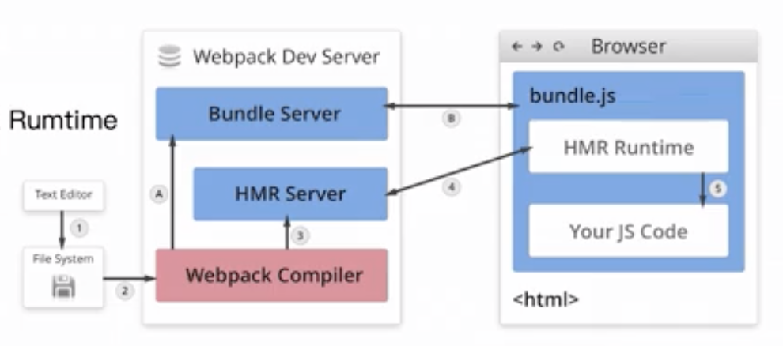

## 为什么需要构建工具?
- 转换 ES6 语法
- 转换 JSX
- CSS 前缀补全/预处理器
- 压缩混淆
- 图片压缩


## 为什么选择webpack?
- 社区生态丰富
- 配置灵活和插件化扩展
- 官方更新迭代速度快


## 环境搭建
1. 安装 node.js 和 npm
2. 安装 webpack 和 webpack-cli


## 通过 npm script 运行 webpack
原理：模块局部安装会在 node_modules/.bin 目录创建软链接。


## webpack核心概念

### Entry
Entry 用来指定 webpack 的打包入口。

理解依赖图的含义：依赖图的入口是 entry，对于非代码如图片、字体依赖也会不断加入到依赖图中。

Entry 的用法：
- 单入口：entry是一个字符串
- 多入口：entry是一个对象

### Output
**Output 用来告诉 webpack 如何将编译后的文件输出到磁盘**。

Output 的用法：
```javascript
// 单入口配置
module.exports = {
  entry: './path/to/my/entry/file.js',
  output: {
    filename: 'bundle.js',
    path: __dirname + '/dist'
  }
}

// 多入口配置
module.exports = {
  entry: {
    app: './src/app.js',
    search: './src/search.js'
  },
  output: {
    filename: '[name].js',  // 通过占位符确保文件名称的唯一
    path: __dirname + '/dist'
  }
}
```

### Loaders
webpack 开箱即用只支持 JS 和 JSON 两种文件类型，通过 Loaders 去支持其他文件类型，把他们转换成有效的模块，并且可以添加到依赖图中。
**Loader 本身是一个函数，接受源文件作为参数，返回转换的结果**。

常见的 loaders：
- babel-loader: 转换 ES6、ES7 等 JS 新特性语法
- css-loader: 支持 .css 文件的加载和解析
- less-loader: 将 less 文件转换成 css
- ts-loader: 将 TS 转换成 JS
- file-loader: 进行图片、字体等的打包
- raw-loader: 将文件以字符串的形式导入
- thread-loader: 多进程打包 JS 和 CSS

Loader 的用法：
```javascript
module.exports = {
  module: {
    rules: [
      {
        test: /\.txt$/,     // test指定匹配规则
        use: 'raw-loader'   // use指定使用的loader名称
      }
    ]
  }
}
```

### Plugins
**Plugins 用于 bundle 文件的优化，资源管理和环境变量注入**。
**Plugins 作用于整个构建过程**。

常见的 plugins：
- CommonsChunkPlugin: 将 chunks 相同的模块代码提取成公共 js
- CleanWebpackPlugin: 清理构建目录
- ExtractTextWebpackPlugin: 将 CSS 从 bundle 文件里提取成一个独立的 CSS 文件
- CopyWebpackPlugin: 将文件或文件夹拷贝到构建的输出目录
- HtmlWebpackPlugin: 创建 html 文件去承载输出的 bundle
- UglifyjsWebpackPlugin: 压缩 JS
- ZipWebpackPlugin: 将打包出的资源生成一个 zip 包

plugin 的用法：
```javascript
module.exports = {
  plugins: [
    new HtmlWebpackPlugin({
      template: './src/index.html'
    })
  ]
}
```

### Mode
Mode 用来指定当前的构建环境是：production、development 还是 none。
设置 Mode 可以使用 webpack 内置的函数，默认值为 production。

Mode 的内置函数功能：
- development: 设置 process.env.NODE_ENV 的值为 development，开启 NamedChunksPlugin 和 NamedModulesPlugin。
- production: 设置 process.env.NODE_ENV 的值为 production，开启 FlagDependencyUsagePlugin，FlagIncludedChunksPlugin，ModuleConcatenationPlugin，NoEmitOnErrorsPlugin，OccurrenceOrderPlugin，SideEffectsFlagPlugin 和 TerserPlugin。
- none: 不开启任何优化选项。


## 如何使用webpack解析ES6和React?
1. 使用 babel-loader
2. babel 的配置文件是 .babelrc
3. 安装：@babel/core，@babel/preset-env，@babel/preset-react，babel-loader

.babelrc 的配置：
```javascript
{
  "presets": [
    "@babel/preset-env",    // 增加 ES6 的 babel preset 配置
    "@babel/preset-react"   // 增加 React 的 babel preset 配置
  ]
}
```

babel 的两个重要概念：
- presets：preset 是一系列 babel plugins 的集合。
- plugins：一个 plugin 对应一个功能。


## 如何使用webpack解析CSS、Less和Sass?

### 解析CSS
1. css-loader 用于加载 .css 文件，并且转换成 commonjs 对象
2. style-loader 将样式通过 `<style>` 标签插入到 head 中

### 解析Less和Sass
1. 在以上基础上
2. less-loader 用于将 less 转换成 css

**注意：loader的执行顺序为从右到左**。


## 如何使用webpack解析图片和字体?
- **使用 file-loader，用于处理文件**。
- **使用 url-loader，url-loader 是基于 file-loader 的，它可以设置较小资源自动转换成 base64**。

使用 file-loader：
```javascript
module.exports = {
  module: {
    rules: [
      {
        test: /\.(png|jpg|gif|jpeg)$/,
        use: 'file-loader'
      },
      {
        test: /\.(woff|woff2|eot|ttf|otf)$/,
        use: 'file-loader'
      }
    ]
  }
}

// 图片使用
import logo from './images/wechat.png'


// 字体使用，在less文件中：
@font-face {
  font-family: 'hanti';
  src: url('./images/hanti.ttf') format('truetype');
}

.search-text {
  font-size: 20px;
  color: #f00;
  font-family: 'hanti';
}
```

使用 url-loader：
```javascript
module.exports = {
  module: {
    rules: [
      {
        test: /\.(png|jpg|gif|jpeg)$/,
        use: [
          {
            loader: 'url-loader',
            options: {
              limit: 20480  // 单位byte，小于这个值得文件，会转换成base64
            }
          }
        ]
      }
    ]
  }
}
```


## webpack中的文件监听
文件监听是在发现源码发生变化时，自动重新构建出新的输出文件。

**webpack开启监听模式，有两种方法：**
- 启动 webpack 命令时，带上 --watch 参数
- 在配置 webpack.config.js 中设置 watch: true

**缺点：每次都需要手动刷新浏览器**。

文件监听的原理：
- **轮询判断文件的最后编辑时间是否变化**。
- **某个文件发生了变化，并不会立刻告诉监听者，而是先缓存起来，等待 aggregateTimeout**。
```javascript
module.exports = {
  watch: true,  // 默认是false
  // 只有开启监听模式，watchOptions才有意义
  watchOptions: {
    ignored: /node_modules/,  // 默认为空，不监听的文件/文件夹，支持正则匹配
    aggregateTimeout: 300,    // 监听到变化发生后会等300ms再去执行，默认300ms
    poll: 1000  // 判断文件是否变化，是通过不停询问系统指定文件有没有变化实现的，默认每秒问1000次
  }
}
```


## webpack中的热更新及原理分析

### 实现热更新的方式
1. webpack-dev-server + HotModuleReplacementPlugin
  - WDS 不需要刷新浏览器
  - WDS 不输出文件，而是放在内存中
2. webpack-dev-middleware
  - WDM 将 webpack 输出的文件传输给服务器
  - 适用于灵活的定制场景

方法1：
```javascript
module.exports = {
  plugins: [
    new webpack.HotModuleReplacementPlugin()
  ],
  devServer: {
    contentBase: './dist',
    hot: true
  }
}
```

方法2：
```javascript
const express = require('express')
const webpack = require('webpack')
const webpackDevMiddleware = require('webpack-dev-middleware')

const app = express()
const config = require('./webpack.config.js')
const compiler = webpack(config)

app.use(webpackDevMiddleware(compiler, {
  publicPath: config.output.publicPath
}))

app.listen(3000, function() {
  console.log('App is listening on port 3000')
})
```

### 热更新的原理分析
- webpack Compile：将 JS 编译成 Bundle
- **HMR Server：将热更新的文件输出给 HMR Runtime**
- Bundle Server：提供文件在浏览器的访问
- **HMR Runtime：会被注入到浏览器，更新文件的变化**
- bundle.js：构建输出的文件

