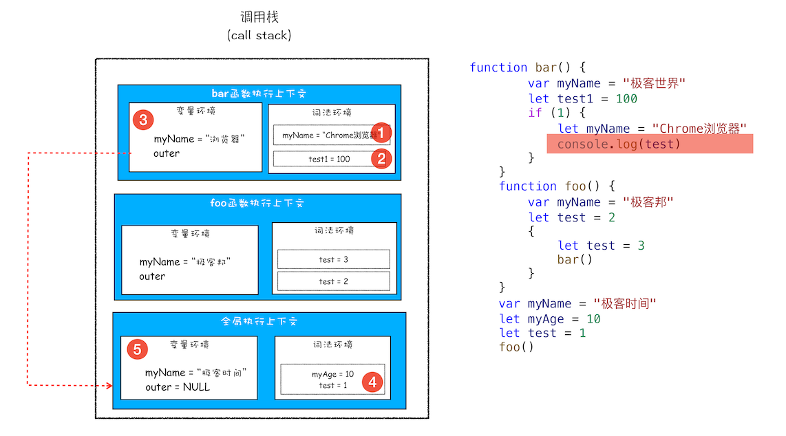

疑问：**代码中出现相同的变量，JavaScript引擎是如何选择的？**

## 作用域链和闭包：代码中出现相同的变量，JavaScript引擎是如何选择的？

```javascript
function bar() {
  console.log(myName) // 极客时间
}
function foo() {
  var myName = '极客邦'
  bar()
  console.log(myName) // 极客邦
}
var myName = '极客时间'
foo()
```

### 作用域链
- 在每个执行上下文的`变量环境`中，都包含了一个外部引用，用来指向外部的执行上下文。
- 变量是通过作用域链来查找的。


那问题来了，**foo函数调用的bar函数，那为什么bar函数的外部引用是全局执行上下文，而不是foo函数的执行上下文？**

这是因为在JavaScript执行过程中，其作用域链是由`词法作用域`决定的。


### 词法作用域
- **词法作用域就是指作用域是由代码中`函数声明的位置`来决定的，所以词法作用域是`静态的作用域`，通过它就能够预测代码在执行过程中如何查找标识符。**
- **词法作用域是`代码阶段`就决定好的，和函数是怎么调用的没有关系。**


### 块级作用域中的变量查找
```javascript
function bar() {
  var myName = '极客世界'
  let test1 = 100
  if (1) {
    let myName = 'Chrome 浏览器'
    console.log(test) // 1
  }
}
function foo() {
  var myName = '极客邦'
  let test = 2
  {
    let test = 3
    bar()
  }
}
var myName = '极客时间'
let myAge = 10
let test = 1
foo()
```




### 闭包
在JavaScript中，根据`词法作用域`的规则，**内部函数总是可以访问其外部函数中声明的变量**，当通过调用一个外部函数返回一个内部函数后，即使该外部函数已经执行结束了，但是`内部函数引用外部函数的变量依然保存在内存中`，我们就把这些`变量的集合称为闭包`。比如外部函数是foo，那么这些变量的集合就称为foo函数的闭包。


当`调用bar.getName的时候`，右边Scope项就体现出了作用域链的情况：**Local就是当前的getName函数的作用域，Closure(foo)是指foo函数的闭包，最下面的Global就是指全局作用域**，从“Local–>Closure(foo)–>Global”就是一个完整的作用域链。


### 闭包是怎么回收的
- 如果引用闭包的函数是一个`全局变量`，那么闭包会一直存在直到`页面关闭`；但如果这个闭包以后不再使用的话，就会造成内存泄漏。
- 如果引用闭包的函数是个`局部变量`，等函数销毁后，在下次JavaScript引擎执行`垃圾回收`时，判断闭包这块内容如果已经不再被使用了，那么JavaScript引擎的垃圾回收器就会回收这块内存。


## this：从JavaScript执行上下文的视角讲清楚this
**作用域链和this是两套不同的系统，它们之间基本没太多联系。**


### JavaScript中的this是什么
- 执行上下文中包含了变量环境、词法环境、外部环境以及this。
- **this是和执行上下文绑定的。**
- this有三种——全局执行上下文中的this、函数中的this和eval中的this。


### 全局执行上下文中的this
- 全局执行上下文中的this是指向`window对象`的。
- 这也是this和作用域链的唯一交点，作用域链的最底端包含了window对象，全局执行上下文中的this也是指向window对象。


### 函数执行上下文中的this
设置函数执行上下文中的this值的三种方式：
#### 1 通过函数的call/apply/bind方法设置。
#### 2 通过对象调用方法设置。
  - **在`全局环境`中调用一个函数，函数内部的this指向的是全局变量window。**
  - **通过一个对象来调用其内部的一个方法，该方法的执行上下文中的this指向对象本身。**
#### 3 通过构造函数中设置。
当执行new CreateObj()的时候，JavaScript引擎做了如下四件事：
- 首先创建了一个空对象tempObj；
- 接着调用CreateObj.call方法，并将tempObj作为call方法的参数，这样当CreateObj的执行上下文创建时，它的this就指向了tempObj对象；
- 然后执行CreateObj函数，此时的CreateObj函数执行上下文中的this指向了tempObj对象；
- 最后返回tempObj对象。


### this的设计缺陷以及应对方案
#### 1 嵌套函数中的this不会从外层函数中继承
```javascript
var myObj = {
  name: '极客时间', 
  showThis: function() {
    console.log(this)   // myObj
    function bar() {
      console.log(this) // Window对象
    }
    bar()
  }
}
myObj.showThis()
```

解决该问题小技巧：
- **在函数中声明一个变量self用来保存this。**这个方法的的本质是**把this体系转换为了作用域的体系**。
- 也可以使用ES6中的`箭头函数`来解决这个问题。**这是因为ES6中的箭头函数并不会创建其自身的执行上下文，所以箭头函数中的this取决于它的`外部函数`。**
```javascript
var myObj = {
  name: '极客时间',
  showThis: function() {
    console.log(this)     // myObj
    var self = this
    function bar() {
      self.name = '极客邦'
    }
    // 箭头函数：
    // var bar = () => {
    //   this.name = '极客邦'
    // }
    bar()
  }
}
myObj.showThis()
console.log(myObj.name)   // 极客邦
console.log(window.name)  // ''
```

总结：`this没有作用域的限制`，这点和变量不一样，所以嵌套函数不会从调用它的函数中继承this，这样会造成很多不符合直觉的代码。要解决这个问题，你可以有两种思路：
- 第一种是把this保存为一个self变量，再`利用变量的作用域机制传递给嵌套函数`。
- 第二种是继续使用this，但是要把嵌套函数改为`箭头函数`，因为箭头函数没有自己的执行上下文，所以它会继承调用函数中的this。

#### 2 普通函数中的this默认指向全局对象window
- 在默认情况下调用一个函数，其执行上下文中的this是默认指向全局对象window的。
- 这样会`打破数据的边界，造成一些误操作`。如果要让函数执行上下文中的this指向某个对象，最好的方式是通过call方法来显示调用。

解决方案：**可以通过设置JavaScript的“严格模式”来解决。在`严格模式`下，默认执行一个函数，其`函数的执行上下文中的this值是undefined`。**
