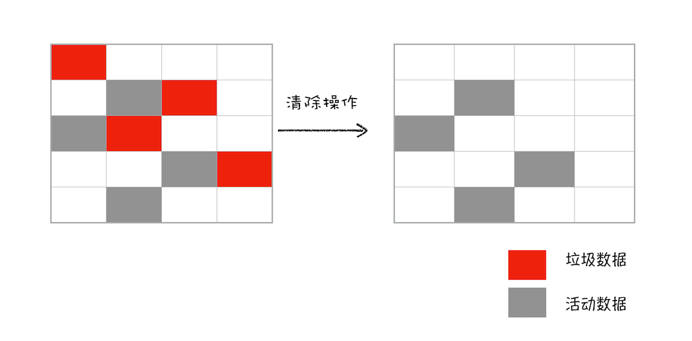

## 栈空间和堆空间：数据是如何存储的？

### JavaScript是什么类型的语言
- 在`使用之前`就需要确认其变量数据类型的称为`静态语言`。在`运行过程中`需要检查数据类型的语言称为`动态语言`。JavaScript是动态语言。
- 支持隐式类型转换的语言称为弱类型语言，不支持隐式类型转换的语言称为强类型语言。JavaScript是弱类型语言。


### JavaScript的数据类型
Boolean、Null、Undefined、Number、BigInt、String、Symbol、Object。


### 内存空间
JavaScript的内存模型：


**在JavaScript的执行过程中， 主要有`三种类型内存空间`，分别是代码空间、栈空间和堆空间。**代码空间主要是存储可执行代码的。


### 栈空间和堆空间
- **`栈空间就是调用栈`，是用来存储执行上下文的。**
- 当执行一段代码时，需要先编译，并创建执行上下文，然后再按照顺序执行代码。
- **原始类型的数据值都是直接保存在“栈”中的，引用类型的值是存放在“堆”中的。**

**为什么一定要分“堆”和“栈”两个存储空间呢？所有数据直接存放在“栈”中不就可以了吗？**
这是因为JavaScript引擎需要用栈来维护程序执行期间上下文的状态，如果`栈空间大`了话，所有的数据都存放在栈空间里面，那么`会影响到上下文切换的效率`，进而又影响到整个程序的执行效率。
- **通常情况下，栈空间都不会设置太大，主要用来存放一些原始类型的小数据。**
- **堆空间很大，能存放很多大的数据**，不过缺点是分配内存和回收内存都会占用一定的时间。
- 原始类型的赋值会完整复制变量值，而引用类型的赋值是复制引用地址。


### 再谈闭包
```javascript
function foo() {
  var myName = '极客时间'
  let test1 = 1
  const test2 = 2
  var innerBar = { 
    setName: function(newName) {
      myName = newName
    },
    getName: function() {
      console.log(test1)
      return myName
    }
  }
  return innerBar
}
var bar = foo()
bar.setName('极客邦')
bar.getName()
console.log(bar.getName())
```

你可能会想：由于变量myName、test1、test2都是原始类型数据，所以在执行foo函数的时候，它们会被压入到调用栈中；当foo函数执行结束之后，调用栈中foo函数的执行上下文会被销毁，其内部变量myName、test1、test2也应该一同被销毁。

**但是当foo函数的执行上下文销毁时，由于foo函数产生了闭包，所以变量myName和test1并没有被销毁，而是保存在内存中，那么应该如何解释这个现象呢？**

要解释这个现象，我们就得站在内存模型的角度来分析这段代码的执行流程。
- 当JavaScript引擎执行到foo函数时，首先会`编译`，并`创建一个执行上下文`。
- 在`编译过程中`，遇到内部函数setName，JavaScript引擎还要对`内部函数`做一次快速的`词法扫描`，发现该内部函数引用了foo函数中的myName变量，由于是内部函数引用了外部函数的变量，所以 `JavaScript引擎判断这是一个闭包`，于是在`堆空间`创建换一个`“closure(foo)”`的对象（这是一个内部对象，JavaScript是无法访问的），用来保存myName变量。
- 接着继续扫描到getName方法时，发现该函数内部还引用变量test1，于是JavaScript引擎又将test1添加到“closure(foo)”对象中。这时候堆中的“closure(foo)”对象中就包含了myName和 test1两个变量了。
- 由于test2并没有被内部函数引用，所以test2依然保存在调用栈中。


总的来说，产生闭包的核心有两步：
- **第一步是需要`预扫描内部函数`；**
- **第二步是把内部函数引用的外部变量保存到堆中。**


## 垃圾回收：垃圾数据是如何自动回收的？

### 调用栈中的数据是如何回收的

- 上面showName的执行上下文虽然保存在栈内存中，但是已经是`无效内存`了。比如当foo函数再次调用另外一个函数时，这块内容会被直接`覆盖`掉，用来存放另外一个函数的执行上下文。
- **当一个函数执行结束之后，JavaScript引擎会通过向下移动ESP(记录当前执行状态的指针)来销毁该函数保存在栈中的执行上下文。**


### 堆中的数据是如何回收的
**要回收堆中的垃圾数据，就需要用到JavaScript中的`垃圾回收器`。**

#### 代际假说和分代收集
代际假说有以下两个特点：
- 第一个是大部分对象在内存中存在的时间很短，简单来说，就是很多对象一经分配内存，很快就变得不可访问；
- 第二个是不死的对象，会活得更久。

通常，垃圾回收算法有很多种，但是并没有哪一种能胜任所有的场景，你需要权衡各种场景，根据对象的生存周期的不同而使用不同的算法，以便达到最好的效果。所以，**在V8中会把堆分为新生代和老生代两个区域，新生代中存放的是生存时间短的对象，老生代中存放的生存时间久的对象。**
- 副垃圾回收器，主要负责新生代的垃圾回收。
- 主垃圾回收器，主要负责老生代的垃圾回收。

#### 垃圾回收器的工作流程
不论什么类型的垃圾回收器，它们都有一套共同的执行流程：
- 第一步是**标记空间中活动对象和非活动对象**。所谓活动对象就是还在使用的对象，非活动对象就是可以进行垃圾回收的对象。
- 第二步是**回收非活动对象所占据的内存**。
- 第三步是**做内存整理**。一般来说，频繁回收对象后，内存中就会存在大量不连续空间，我们把这些不连续的内存空间称为`内存碎片`。当内存中出现了大量的内存碎片之后，如果需要分配较大连续内存的时候，就有可能出现内存不足的情况。所以最后一步需要整理这些内存碎片。

#### 副垃圾回收器
新生代中用Scavenge算法来处理。所谓Scavenge算法，是把**新生代空间对半划分为两个区域，一半是对象区域，一半是空闲区域**。


新加入的对象都会存放到对象区域，**当对象区域快被写满时**，就需要执行一次`垃圾清理操作`：

1. 对对象区域中的`垃圾`做`标记`，**标记方法同老生代的标记过程阶段**；
2. 标记完成之后，就进入垃圾清理阶段，副垃圾回收器会把这些`存活`的对象`复制`到空闲区域中，同时它还会把这些对象有序地`排列`起来，所以这个复制过程，也就相当于完成了内存整理操作。
3. 完成复制后，对象区域与空闲区域进行`角色翻转`，也就是原来的对象区域变成空闲区域，原来的空闲区域变成了对象区域。

由于新生代中采用的Scavenge算法，所以每次执行清理操作时，都需要将存活的对象从对象区域复制到空闲区域。但复制操作需要时间成本，如果新生区空间设置得太大了，那么每次清理的时间就会过久，所以**为了执行效率，一般新生区的空间会被设置得比较小**。

所以新生区很容易被存活的对象装满整个区域。为了解决这个问题，JavaScript引擎采用了`对象晋升策略`，也就是**经过两次垃圾回收依然还存活的对象，会被移动到老生区中**。

#### 主垃圾回收器
主垃圾回收器主要负责老生区中的垃圾回收。除了新生区中晋升的对象，一些大的对象会直接被分配到老生区。因此老生区中的对象有两个特点：
- 一个是对象**占用空间大**；
- 另一个是对象**存活时间长**。

主垃圾回收器是采用`标记-清除（Mark-Sweep）`的算法进行垃圾回收。

1. 标记过程阶段。标记阶段就是从`一组根元素`开始，递归遍历这组根元素，在这个遍历过程中，`能到达`的元素称为**活动对象**，没有到达的元素就可以判断为**垃圾数据**。

2. 垃圾的清除过程。它和副垃圾回收器的垃圾清除过程完全不同。

3. `标记-整理（Mark-Compact）`。让所有存活的对象都向一端移动，然后直接清理掉端边界以外的内存。


#### 全停顿
由于JavaScript是运行在主线程之上的，一旦执行垃圾回收算法，都需要将正在执行的JavaScript脚本暂停下来，待垃圾回收完毕后再恢复脚本执行。这种行为叫做`全停顿（Stop-The-World）`。


在V8新生代的垃圾回收中，因其空间较小，且存活对象较少，所以全停顿的影响不大，但老生代就不一样了。

- 为了降低老生代的垃圾回收而造成的卡顿，V8将标记过程分为一个个的**子标记过程**，同时让垃圾回收标记和JavaScript应用逻辑**交替**进行，直到标记阶段完成，我们把这个算法称为`增量标记（Incremental Marking）`算法。
- 使用增量标记算法，可以把一个完整的垃圾回收任务拆分为很多小的任务，这些小的任务执行时间比较短，可以穿插在其他的JavaScript任务中间执行。

