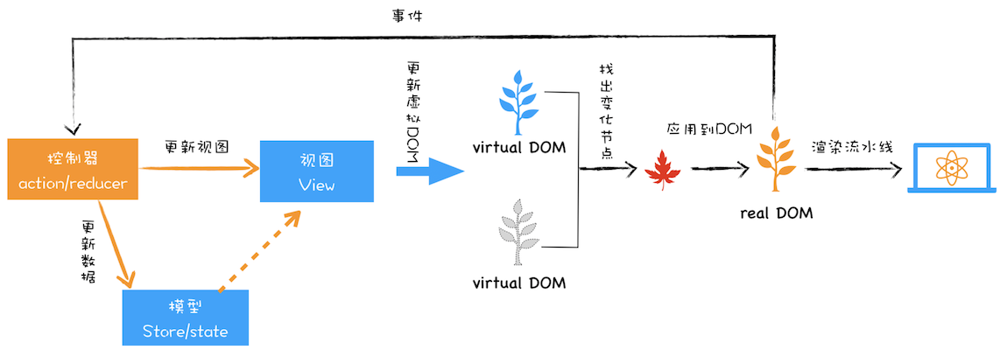

## 分层和合成机制：为什么CSS动画比JavaScript高效？

### 显示器是怎么显示图像的
每个显示器都有固定的刷新频率，通常是60HZ，也就是每秒更新60张图片，更新的图片都来自于显卡中一个叫**前缓冲区**的地方。
- 显示器：每秒固定`读取`60次前缓冲区中的图像，并将读取的图像`显示`到显示器上。
- 显卡：`合成新的图像`，并将图像保存到**后缓冲区**中，一旦显卡把合成的图像写到后缓冲区，系统就会让后缓冲区和前缓冲区互换，这样就能保证显示器能读取到最新显卡合成的图像。
- 通常情况下，显卡的更新频率和显示器的刷新频率是一致的。

### 帧VS帧率
- **在滚动或者缩放操作时，`渲染引擎`会通过渲染流水线`生成新的图片`，并发送到`显卡的后缓冲区`。**
- 大多数设备屏幕的更新频率是60次/秒，这也就意味着正常情况下要实现流畅的动画效果，渲染引擎需要每秒更新60张图片到显卡的后缓冲区。
- 帧：渲染流水线生成的每一幅图片称为一帧。
- 帧率：渲染流水线每秒更新了多少帧称为帧率。
- **要解决卡顿问题，就要解决每帧生成时间过久的问题**，为此Chrome对浏览器渲染方式做了大量的工作，其中最卓有成效的策略就是引入了分层和合成机制。`分层和合成机制代表了当今最先进的渲染技术`。

### 如何生成一帧图像
渲染流水线生成图像方式：有**重排、重绘和合成**三种方式。

### Chrome是怎么实现分层和合成机制的？
- **布局树 => 图层树 => 绘制(将绘制指令组合成一个列表) => `光栅化(按照绘制列表中的指令生成图片，每一个图层都对应一张图片)` => `合成线程将这些图层图片合成一张图片` => 将图片发送到显卡的后缓冲区**
- **合成操作是在合成线程上完成的，这也就意味着在执行合成操作时，是不会影响到主线程执行的**。这就是为什么经常主线程卡住了，但是CSS动画依然能执行的原因。

### 如何利用分层技术优化代码
- 如果涉及到一些可以使用合成线程来处理CSS特效或者动画的情况，就尽量使用`will-change`来提前告诉渲染引擎，让它为该元素准备独立的层。
- 每当渲染引擎为一个元素准备一个独立层的时候，它占用的内存也会大大增加。
- 如果使用JavaScript来写这些效果，会牵涉到整个渲染流水线，所以JavaScript的绘制效率会非常低下。

## 页面性能：如何系统地优化页面？
通常一个页面有三个阶段：**加载阶段、交互阶段和关闭阶段**。
- 加载阶段：网络和JavaScript脚本。
- 交互阶段：JavaScript脚本。
- 关闭阶段：用户发出关闭指令后页面所做的一些清理操作。

### 加载阶段
**能阻塞网页首次渲染的资源称为关键资源**——JavaScript、HTML、CSS。
- 关键资源个数。内联、async/defer等。
- 关键资源大小。压缩等。
- 请求关键资源需要多少个RTT（Round Trip Time）。**RTT是往返时延。它是网络中一个重要的性能指标，表示从发送端发送数据开始，到发送端收到来自接收端的确认，总共经历的时延**。CDN等。

### 交互阶段
谈交互阶段的优化，其实就是在谈渲染进程渲染帧的速度。
- **1 减少JavaScript脚本执行时间**。`分解任务、将和DOM操作无关且耗时的任务放到Web Workers中去执行`。
- **2 避免强制同步布局**。
  - 正常情况下的布局操作：执行JavaScript添加元素是在一个任务中执行的，重新计算样式布局是在另外一个任务中执行。
  - **所谓强制同步布局，是指JavaScript`强制将计算样式和布局操作提前到当前的任务中`**。
- **3 避免布局抖动**。
  - 所谓布局抖动，是指在一次JavaScript执行过程中，多次执行强制布局和抖动操作。
  - `尽量不要在修改DOM结构时再去查询一些相关值`。
- **4 合理利用CSS合成动画**。
  - **合成动画是直接在合成线程上执行的，如果主线程被JavaScript或者一些布局任务占用，CSS动画依然能继续执行**。
- **5 避免频繁的垃圾回收**。
  - 自动垃圾回收机制会占用主线程，从而影响到其他任务的执行。
  - **尽可能优化储存结构，尽可能避免小颗粒对象的产生**。

## 虚拟DOM：虚拟DOM和实际的DOM有何不同？

### 什么是虚拟DOM？
虚拟DOM是怎么运行的？
- **创建阶段**。依据JSX和基础数据创建出来虚拟DOM => 由虚拟DOM树创建出真实DOM树 => 触发渲染流水线往屏幕输出页面。
- **更新阶段**。根据新的数据创建一个新的虚拟DOM树 => 比较新老树，将变化部分更新到真实DOM树 => 渲染。

#### 双缓存
- 使用双缓存，可以让你先将计算的中间结果存放在另一个缓冲区中，等全部的计算结束，该缓冲区已经存储了完整的图形之后，再将该缓冲区的图形数据一次性复制到显示缓冲区，这样就使得整个图像的输出非常稳定。
- 可以把虚拟DOM看成是DOM的一个buffer，和图形显示一样，它会在完成一次完整的操作之后，再把结果应用到DOM上，这样就能减少一些不必要的更新，同时还能保证DOM的稳定输出。

#### MVC模式
基于React和Redux构建MVC模型：

## 渐进式网页应用(PWA)：它究竟解决了Web应用的哪些问题？
PWA，它是一套`理念`，**渐进式增强Web的优势，并通过技术手段渐进式缩短和本地应用或者小程序的距离**。基于这套理念之下的技术都可以归类到PWA。

### Web应用VS本地应用
相对于本地应用，Web页面到底缺少了什么？
- **离线使用能力**。解决：Service Worker。
- **消息推送能力**。解决：Service Worker。
- **缺少一级入口**。解决：manifest.json。

### 什么是Service Worker？
Service Worker的主要思想是**在页面和网络之间增加一个`拦截器`，用来`缓存和拦截`请求**。
- 在没有安装Service Worker之前，WebApp都是直接通过网络模块来请求资源的。
- 安装了Service Worker模块之后，WebApp请求资源时，会先通过Service Worker，让它判断是返回Service Worker缓存的资源还是重新去网络请求资源。

### Service Worker的设计思路
#### 1 架构
- **“让其运行在主线程之外”就是Service Worker来自Web Worker的一个核心思想**。
- 不过Web Worker是临时的，每次JavaScript脚本执行完成之后都会退出，执行结果也不能保存下来，如果下次有同样的操作，还得重新来一遍。
- 所以`Service Worker需要在Web Worker的基础之上加上储存功能`。
- 由于Service Worker还需要会为多个页面提供服务，所以还**不能把Service Worker和单个页面绑定起来**。
- 在Chrome中，Service Worker是运行在`浏览器进程`中的，因为浏览器进程生命周期是最长的，所以在浏览器的生命周期内，能够为所有的页面提供服务。

#### 2 消息推送
- **消息推送也是基于Service Worker来实现的**。
- 因为消息推送时，浏览器页面也许并没有启动，这时就需要Service Worker来接收服务器推送的消息，并将消息通过一定方式展示给用户。

#### 3 安全
除了必须要使用`HTTPS`，Service Worker还需要同时支持`Web页面默认的安全策略、储入同源策略、内容安全策略（CSP）`等。

## WebComponent：像搭积木一样构建Web应用
WebComponent是一套技术的组合，具体涉及到了`Custom elements(自定义元素)、Shadow DOM(影子DOM)和HTML templates(HTML模板)`。

### WebComponent组件化开发
- 首先，使用`template`属性来创建模板。
- 其次，我们需要创建一个GeekBang的类。在该类的构造函数中要完成三件事：
  - 查找模板内容；
  - 创建影子DOM；**影子DOM的作用是`将模板中的内容与全局DOM和CSS进行隔离`，这样我们就可以实现元素和样式的私有化了**。
  - 再将模板添加到影子DOM上。
- 使用`customElements.define`来自定义元素。
- 最后，像正常使用HTML元素一样使用该元素。

### 浏览器如何实现影子DOM？
影子DOM的作用主要有以下两点：
- 影子DOM中的元素对于整个网页是不可见的；
- 影子DOM的CSS不会影响到整个网页的CSSOM，影子DOM内部的CSS只对内部的元素起作用。

影子DOM的实现：
- 浏览器为了实现影子DOM的特性，在代码内部做了大量的`条件判断`，比如当通过DOM接口去查找元素时，渲染引擎会去判断geek-bang属性下面的`shadow-root元素`是否是影子DOM，如果是影子DOM，那么就直接跳过shadow-root元素的查询操作。所以这样通过DOM API就无法直接查询到影子DOM的内部元素了。
- 当生成布局树的时候，渲染引擎也会判断geek-bang属性下面的`shadow-root元素`是否是影子DOM，如果是，那么在影子DOM内部元素的节点选择CSS样式的时候，会直接使用影子DOM内部的CSS属性。
