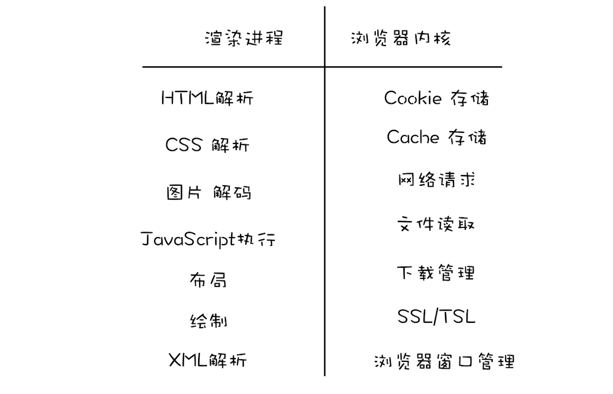

## 安全沙箱：页面和系统之间的隔离墙
### 安全视角下的多进程架构
疑问：
- 为什么一定要通过浏览器内核去请求资源，再将数据转发给渲染进程，而不直接从进程内部去请求网络资源？
- 为什么渲染进程只负责生成页面图片，生成图片还要经过IPC通知浏览器内核模块，然后让浏览器内核去负责展示图片？

### 安全沙箱
- 由于渲染进程需要执行DOM解析、CSS解析、网络图片解码等操作，如果渲染进程中存在系统级别的漏洞，那么以上操作就有可能让恶意的站点获取到渲染进程的控制权限，进而又获取操作系统的控制权限，这对于用户来说是非常危险的。
- **将渲染进程和操作系统隔离的这道墙就是安全沙箱。**
- **安全沙箱最小的保护单位是进程**。因为单进程浏览器需要频繁访问或者修改操作系统的数据，所以单进程浏览器是无法被安全沙箱保护的，而现代浏览器采用的多进程架构使得安全沙箱可以发挥作用。

### 安全沙箱如何影响各个模块功能

安全沙箱是如何影响到各个模块功能的呢？
- **持久存储**。Cookie、缓存文件的读写都是由浏览器内核实现，通过IPC将内容返回给渲染进程。
- **网络访问**。浏览器内核在处理URL请求之前，会检查渲染进程是否有权限请求该URL。
- **用户交互**。

**渲染进程不能直接访问窗口句柄：**
- 第一点，渲染进程需要渲染出位图。为了向用户显示渲染进程渲染出来的位图，`渲染进程需要将生成好的位图发送到浏览器内核`，然后浏览器内核将位图复制到屏幕上。
- 第二点，操作系统没有将用户输入事件直接传递给渲染进程，而是将这些事件传递给浏览器内核。然后`浏览器内核再根据当前浏览器界面的状态来判断如何调度这些事件`，如果当前焦点位于浏览器地址栏中，则输入事件会在浏览器内核内部处理；如果当前焦点在页面的区域内，则浏览器内核会将输入事件转发给渲染进程。

### 站点隔离(Site Isolation)
**所谓站点隔离是指Chrome将同一站点（包含了相同根域名和相同协议的地址）中相互关联的页面放到同一个渲染进程中执行。**

## HTTPS：让数据传输更安全
### 在HTTP协议栈中引入安全层
安全层的两个主要职责：
- **对发起HTTP请求的数据进行加密操作**。
- **对接收到HTTP的内容进行解密操作**。

利用这个安全层，一步一步实现一个从简单到复杂的HTTPS协议。

### 第一版：使用对称加密
**对称加密是指`加密`和`解密`都使用的是`相同的密钥`**。

- 浏览器发送它所支持的加密套件列表和一个随机数client-random，这里的**加密套件是指加密的方法**，加密套件列表就是指浏览器能支持多少种加密方法列表。
- `服务器`会从加密套件列表中`选取一个加密套件`，然后还会生成一个随机数service-random，并将service-random和加密套件列表返回给浏览器。
- 最后浏览器和服务器分别返回确认消息。
- 这样浏览器端和服务器端都有相同的client-random和service-random了，然后它们再使用`相同的方法`将client-random和service-random混合起来`生成一个密钥`master secret，有了密钥master secret和加密套件之后，双方就可以进行数据的加密传输了。
- **缺点：加密套件和密钥是明文传输的。**

### 第二版：使用非对称加密
- **非对称加密算法有A、B两把密钥，如果你用A密钥来加密，那么只能使用B密钥来解密；反过来，如果你要B密钥来加密，那么只能用A密钥来解密。**
- 在HTTPS中，服务器会将其中的一个密钥通过明文的形式发送给浏览器，我们把这个密钥称为`公钥`，服务器自己留下的那个密钥称为`私钥`。
- **公钥是每个人都能获取到的，而私钥只有服务器才能知道，不对任何人公开。**

- 首先浏览器还是发送`加密套件列表`给服务器。
- 然后服务器会选择一个加密套件，不过和对称加密不同的是，使用非对称加密时服务器上需要有用于`浏览器加密的公钥和服务器解密HTTP数据的私钥`，由于公钥是给浏览器加密使用的，因此服务器会将加密套件和公钥一道发送给浏览器。
- 最后就是浏览器和服务器返回确认消息。
- 采用非对称加密，就能保证**浏览器发送给服务器的数据是安全的**。

非对称加密方式的缺点：
- **第一个是非对称加密的效率太低。**
- **第二个是无法保证服务器发送给浏览器的数据安全。**`虽然浏览器端可以使用公钥来加密，但是服务器端只能采用私钥来加密，私钥加密只有公钥能解密，但黑客也是可以获取得到公钥的，这样就不能保证服务器端数据的安全了。`

### 第三版：对称加密和非对称加密搭配使用
**在传输数据阶段依然使用对称加密，但是`对称加密的密钥`我们采用`非对称加密`来传输。**

- 首先浏览器向服务器发送对称加密套件列表、非对称加密套件列表和随机数client-random；
- 服务器保存随机数client-random，选择对称加密和非对称加密的套件，然后生成随机数service-random，向浏览器发送选择的加密套件、service-random和公钥；
- 浏览器保存公钥，并利用client-random和service-random计算出来pre-master，然后利用公钥对pre-master加密，并向服务器发送加密后的数据；
- 最后服务器拿出自己的私钥，解密出pre-master数据，并返回确认消息。
- 到此为止，**服务器和浏览器就有了共同的client-random、service-random和pre-master，然后服务器和浏览器会`使用这三组随机数生成对称密钥`，因为服务器和浏览器使用同一套方法来生成密钥，所以最终生成的密钥也是相同的**。
- **pre-master是经过公钥加密之后传输的，所以黑客无法获取到pre-master，这样黑客就无法生成密钥，也就保证了黑客无法破解传输过程中的数据了**。

缺点：采用这种方式虽然能保证数据的安全传输，`但是依然没办法证明服务器是可靠的`，于是又引入了数字证书，数字证书是由CA签名过的，所以浏览器能够验证该证书的可靠性。

### 第四版：添加数字证书
对于浏览器来说，数字证书有两个作用：
- 一个是**通过数字证书向浏览器证明服务器的身份**；
- 另一个是**数字证书里面包含了服务器公钥**。

与第三版的区别：
- `服务器`没有直接返回公钥给浏览器，而是`返回了数字证书`，而公钥正是包含在数字证书中的；
- 在`浏览器`端多了一个`证书验证`的操作，验证了证书之后，才继续后续流程。

通过引入数字证书，我们就实现了服务器的身份认证功能，这样即便黑客伪造了服务器，但是由于证书是没有办法伪造的，所以依然无法欺骗用户。

### 数字证书的申请和验证
#### 生成数字签名的过程：
- 首先CA使用`Hash函数`来计算xxx提交的明文信息，并得出**信息摘要**；
- 然后CA再使用它的`私钥`对信息摘要进行加密，**加密后的密文就是CA颁给xxx的数字签名**。
- 这就相当于房管局在房产证上盖的章，这个章是可以去验证的，同样我们也可以`通过数字签名来验证是否是该CA颁发的`。

#### 浏览器如何验证数字证书？
- 有了CA签名过的数字证书，当浏览器向xxx服务器发出请求时，服务器会返回数字证书给浏览器。
- 首先浏览器读取证书中相关的`明文信息`，采用CA签名时相同的`Hash函数`来计算并得到`摘要信息A`；
- 然后再利用对应CA的`公钥解密签名数据`，得到`摘要信息B`；
- 对比信息摘要A和信息摘要B，如果一致，则可以确认证书是合法的，即证明了这个服务器是xxx的；同时浏览器还会验证证书相关的域名信息、有效时间等信息。
